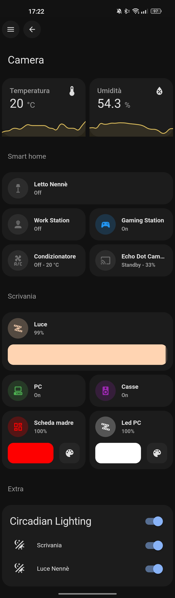

# Home Assistant Configuration

Here's my personal [Home Assistant](https://home-assistant.io/) configuration.

I have installed HA on a [Fujitsu Esprimo Q920](https://www.amazon.it/gp/product/B0854LM164) with 16GB RAM (2x [Patriot PSD38G1600L2S](https://www.amazon.it/gp/product/B009WIW9GE)) and 1TB SSD as a [VM](https://community.home-assistant.io/t/home-assistant-os-installation-on-proxmox-ve-7-tutorial/335964) on top of [Proxmox VE](https://www.proxmox.com/en/proxmox-ve).

I regularly update my configuration files. You can check my current Home Assistant version [here](.HA_VERSION).

## Other things that I run on my Home Server
- [AdGuard Home](https://adguard.com/en/adguard-home/overview.html) LXC
- [Transmission](https://transmissionbt.com/) LXC
- [Docker](https://www.docker.com/) LXC
  - [InfluxDB](https://www.influxdata.com/) Docker container
  - [Grafana](https://grafana.com/) Docker container
  - [Prometheus](https://prometheus.io/) Docker container
  - [cAdvisor](https://github.com/google/cadvisor) Docker container
  - [Dashy](https://dashy.to/) Docker container
  - [NginxProxyManager](https://nginxproxymanager.com/) Docker container
  - [Portainer](https://portainer.io/) Docker container
  - [UptimeKuma](https://github.com/louislam/uptime-kuma) Docker container
  - [WireGuard](https://www.wireguard.com/) Docker container
  - [Broadlink Manager](https://github.com/t0mer/broadlinkmanager-docker) Docker container

## Additional Hardware
- 1x [KYYKA CC2531](https://www.amazon.it/gp/product/B08Q7NPSRX) with Zigbee2MQTT Firmware
- 1x [SABRENT BT-UB40](https://www.amazon.it/dp/B06XHY5VXF)
- 1x [SwitchBot Hub Mini](https://www.switch-bot.com/products/switchbot-hub-mini) for IR remote control
- 1x [SwitchBot Bot](https://www.switch-bot.com/pages/switchbot-bot)
- 1x [Fire TV 4k Max](https://www.amazon.it/dp/B08MT4MY9J)
- 1x Echo (4th gen)
- 1x Echo Show 5 (2nd gen)
- 1x Echo Dot (3rd gen)
- 1x Broadlink RM4 Pro
- 1x Broadlink RM3 Mini

> smart bulbs, led strips, temperature and humidity sensors, smart plugs list and missing links incoming...

## Software Integrations
> WIP

## Lovelace
**NOTE:** I moved my entire configuration to Lovelace UI editor, so YAMLs could be a bit outdated. I will try to update them regularly to reflect the latest changes.

### Mobile
(current theme: [Mushroom Theme](https://github.com/piitaya/lovelace-mushroom-themes) with [Mushroom](https://github.com/piitaya/lovelace-mushroom) cards)

