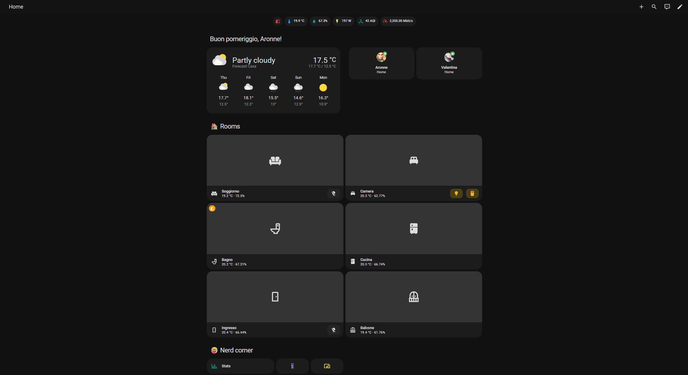
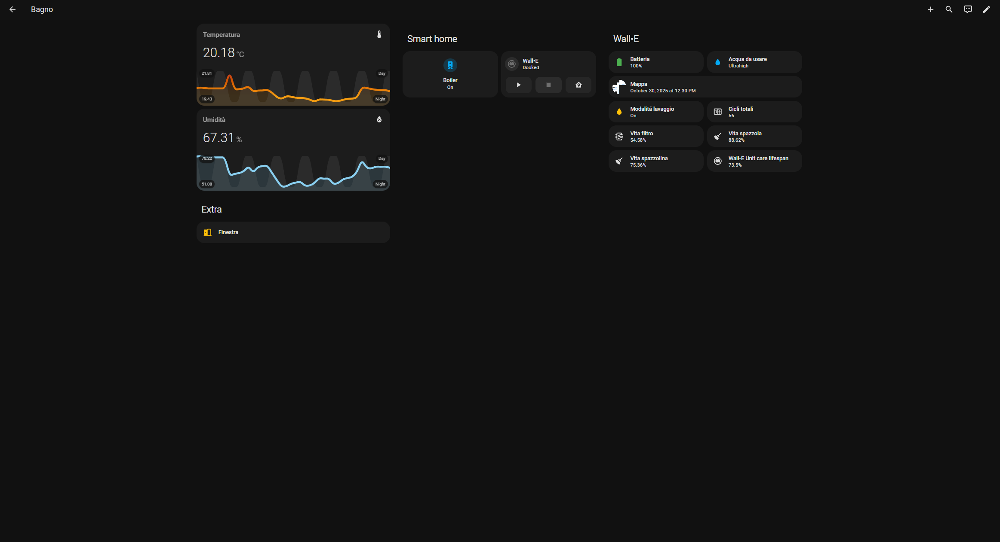
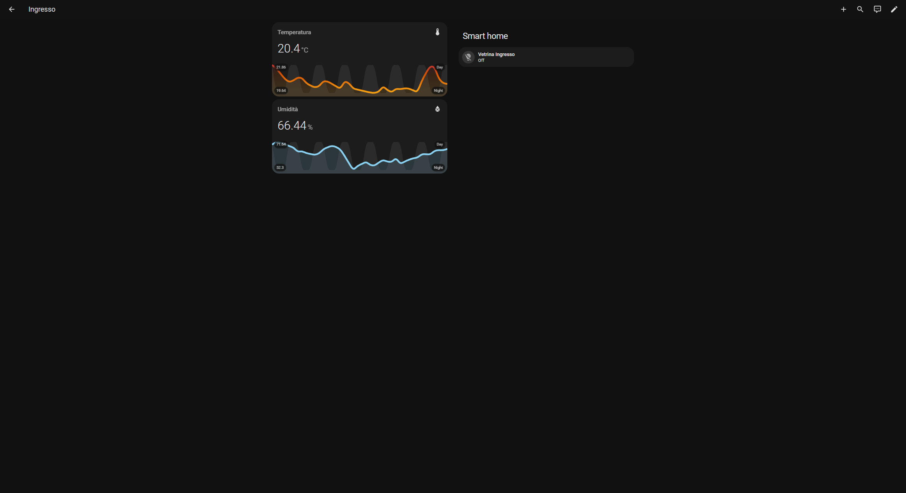
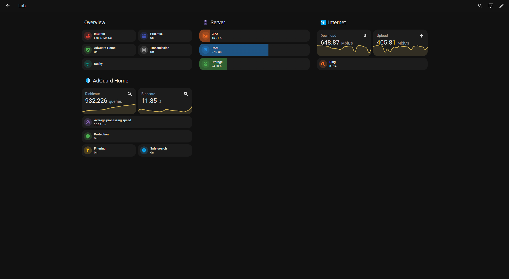
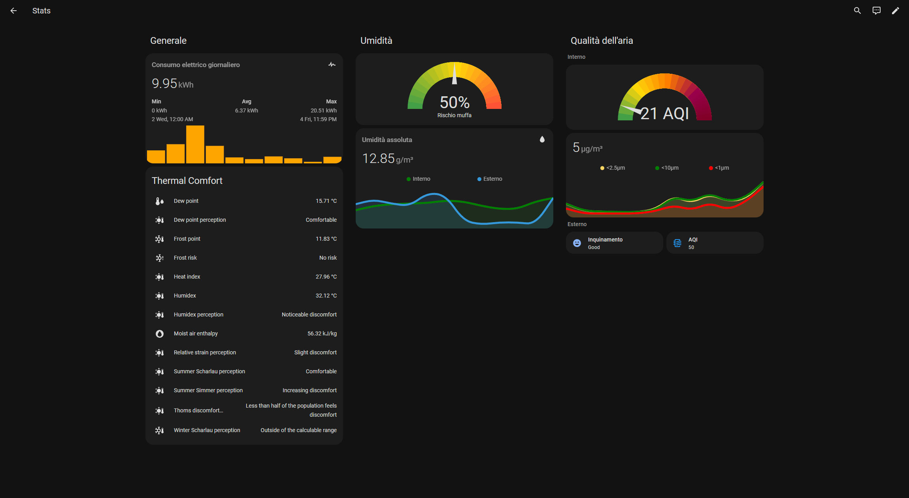
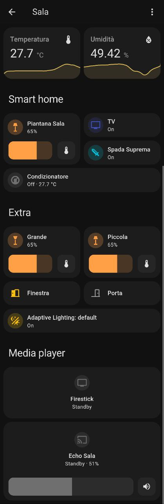

# Home Assistant Configuration

Here's my personal [Home Assistant](https://home-assistant.io/) configuration.

I have installed HA on a [Fujitsu Esprimo Q920](https://www.amazon.it/gp/product/B0854LM164) with 16GB RAM (2x [Patriot PSD38G1600L2S](https://www.amazon.it/gp/product/B009WIW9GE)) and 1TB SSD as a [VM](https://community.home-assistant.io/t/home-assistant-os-installation-on-proxmox-ve-7-tutorial/335964) on top of [Proxmox VE](https://www.proxmox.com/en/proxmox-ve).

I regularly update my configuration files. You can check my current Home Assistant version [here](.HA_VERSION).

## Some statistics about my installation:

Description | value
-- | --
Number of entities | 581
Number of sensors | 298

## My installed extensions:

### Add-ons
- Advanced SSH & Web Terminal
- ESPHome Device Builder
- File editor
- Home Assistant Google Drive Backup
- Home-Assistant-Matter-Hub
- Matter Server
- Mosquitto broker
- RPC Shutdown
- Samba share
- Speedtest
- Zigbee2MQTT

### Custom integrations
- [Adaptive Lighting](https://github.com/basnijholt/adaptive-lighting)
- [Alexa Media Player](https://github.com/alandtse/alexa_media_player)
- [Generate Readme](https://github.com/custom-components/readme)
- [HACS](https://github.com/hacs/integration)
- [Openrgb](https://github.com/openrgb-ha/openrgb-ha)
- [Smartir](https://github.com/smartHomeHub/SmartIR)
- [Spook 👻 Your Homie](https://github.com/frenck/spook)
- [Spotcast](https://github.com/fondberg/spotcast)
- [Thermal Comfort](https://github.com/dolezsa/thermal_comfort)
- [Waste Collection Schedule](https://github.com/mampfes/hacs_waste_collection_schedule)

### Lovelace plugins
- [Card Mod](https://github.com/thomasloven/lovelace-card-mod)
- [Mini Graph Card](https://github.com/kalkih/mini-graph-card)
- [Mushroom](https://github.com/piitaya/lovelace-mushroom)
- [Simple Weather Card](https://github.com/kalkih/simple-weather-card)
- [Stack In Card](https://github.com/custom-cards/stack-in-card)
- [Xiaomi Vacuum Map Card](https://github.com/PiotrMachowski/lovelace-xiaomi-vacuum-map-card)

### Themes

## Lovelace
**NOTE:** I moved my entire configuration to Lovelace UI editor, [ui-lovelace.yaml](ui-lovelace.yaml) is auto-generated.

  
Desktop

    
    
    
    
    
    
    
    
    

  
Mobile

    
    
    
    
    
    
    
    
    
    

## Other things that I run on my Home Server
- [AdGuard Home](https://adguard.com/en/adguard-home/overview.html) LXC
- [WireGuard](https://www.wireguard.com/) LXC
- [Transmission](https://transmissionbt.com/) LXC
- [Docker](https://www.docker.com/) LXC
  - [InfluxDB](https://www.influxdata.com/) Docker container
  - [Grafana](https://grafana.com/) Docker container
  - [Prometheus](https://prometheus.io/) Docker container
  - [cAdvisor](https://github.com/google/cadvisor) Docker container
  - [Dashy](https://dashy.to/) Docker container
  - [NginxProxyManager](https://nginxproxymanager.com/) Docker container
  - [Portainer](https://portainer.io/) Docker container
  - [UptimeKuma](https://github.com/louislam/uptime-kuma) Docker container
  - [Broadlink Manager](https://github.com/t0mer/broadlinkmanager-docker) Docker container
  - [Watchtower](https://containrrr.dev/watchtower/) Docker container
  - [Vaultwarden](https://www.vaultwarden.net/) Docker container

## Additional Hardware
- 1x [KYYKA CC2531](https://www.amazon.it/gp/product/B08Q7NPSRX) with Zigbee2MQTT Firmware
- 1x [SABRENT BT-UB40](https://www.amazon.it/dp/B06XHY5VXF)
- 1x [SwitchBot Hub Mini](https://www.switch-bot.com/products/switchbot-hub-mini) for IR remote control
- 1x [SwitchBot Bot](https://www.switch-bot.com/pages/switchbot-bot)
- 1x [Fire TV 4k Max](https://www.amazon.it/dp/B08MT4MY9J)
- 1x Echo (4th gen)
- 1x Echo Show 5 (2nd gen)
- 1x Echo Dot (3rd gen)
- 1x Broadlink RM4 Pro
- 1x Broadlink RM3 Mini
- 1x ESP32 + PMS5003 sensor
- 1x ESP8266 + relay

> smart bulbs, led strips, temperature and humidity sensors, smart plugs list and missing links incoming...

***

Generated by the [custom readme integration](https://github.com/custom-components/readme)